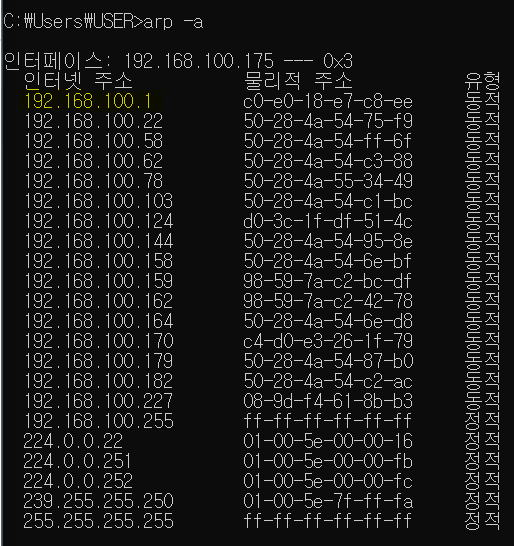

# Day 3: Routing, Public/Private IPs, DHCP

## CMD arp -a

- **ARP = Address Resolution Protocol** (Check on Day 6)

**192.168.100.1**

- A typical next-hop address
- To use the internet, this address must be reached.

## Cisco Packet Tracer (continued)

- **Same devices connected**: Cross cable
- **Different devices connected**: Straight-through cable
- **Router**: Divides networks
- **Same switch = Same network**
- **Router's Longest Match Rule**: When there are two default gateways, the router compares the destination IP with the routes in the routing table and chooses the one with the most matching bits in binary. This process determines which path to take for the destination IP.

### Router Commands (continue to add)

1. `do sh run`: View overall settings (including subnet mask)
2. `do sh ip int br`: Shows IP settings and link status of interfaces
3. `do sh ip route`: Check routing table
4. `Ctrl+C`: Exit (after using `do sh run`)
5. `no ip route [IP] [SM]`: Delete IP from the routing table
6. `no ip dhcp pool [name]`: Delete the pool

### 💻 Lab 1

- The red line divides different networks.
- **Number of networks**: **2**  
  (Router and computer connected to the same switch are considered the same network)
- **PC ↔ R2 communication** requires routing.  
  Reason: R2 doesn't know the 192.168.100.254 address entered in R1.
- Steps:
  1. **PC > IP Configuration**
    - Set Default Gateway
    - If the routing table doesn't have the destination, the data will go out through the default gateway.
  2. Assign IPs to R1's **F0/1 & F0/0** interfaces  
     ⇒ **R1 ↔ PC** communication is successful (ping successful)
  3. Assign IP to **R2 F0/0** interface  
     **R2 ↔ PC** is not possible yet → Routing is needed
  4. Set up routing on **R2**:  
     `#ip route 192.168.100.0 255.255.255.0 1.1.1.10`  
     ⇒ **R2 ↔ PC** communication is successful (ping successful)
  5. Add default route on **R2**:  
     `#ip route 0.0.0.0 0.0.0.0 1.1.1.10`  
     This tells R2 to route unknown destinations through this gateway.
  
  **R2 Routing Table:**
C 1.1.1.0 is directly connected, FastEthernet0/0 
S 192.168.100.0/24 [1/0] via 1.1.1.10 
S* 0.0.0.0/0 [1/0] via 1.1.1.10

### 💻 Lab 2: Enable Communication Between Both PCs

Additional settings required:
1. Set IP on the right-side PC.
2. Configure routing on **R1**.
3. Test communication by pinging between the PCs.

### ✅ Problem

You are given the network **10.20.30.80 /28**.

Using only this network, create a topology.

Ignore public/private IPs.

- Network range: **10.20.30.80 ~ 10.20.30.95** with subnet mask **255.255.255.240**  
Subnetting into 4 subnets (2^2):  
**80-83, 84-87, 88-91, 92-95**, Prefix: /28 → Subnet mask: 255.255.255.252

---

## Public IPs / Private IPs

- IP addresses are 32-bit, providing about 4.1 billion possible addresses, which is insufficient.  
Therefore, **Public IPs** are used for external addresses, and **Private IPs** are used internally.
- Internal networks can use public IPs, but typically private IPs are used inside.
- **Private IPs** can be reused across different networks, which resolves IP scarcity.

### Unusable Special Addresses:

1. **Private IPs** 💡
 - Class A private range: `10.0.0.0 /8`
 - Class B private range: `172.16.0.0 /12` (Range: `172.16.0.0 ~ 172.31.255.255`)
 - Class C private range: `192.168.0.0 /16`
 - **NAT**: When private IPs need to be converted to public IPs.

2. **127.0.0.0 /8**  
 - Loopback address

3. **169.254.0.0 /16**  
 - Automatic private IP addressing (APIPA) when the client cannot obtain an IP address.

4. **192.0.2.0 /24**  
 - Reserved for documentation and testing.

---

## DHCP (Dynamic Host Configuration Protocol)

- **Dynamic**: Automatic, **Host**: Provides IP to the client.

### DHCP Process:
1. **Discover**: (Client → Server) The client broadcasts a message asking if anyone can provide an IP address.
2. **Offer**: (Server → Client) The server offers an IP address.
3. **Request**: (Client → Server) The client requests the offered IP address.
4. **Ack**: (Server → Client) The server acknowledges and assigns the IP address.

1. **Discover**: The client broadcasts "Is anyone offering an IP?" using its MAC address.
2. **Offer**: The server replies with an available IP.
3. **Request**: The client requests to use the offered IP.
4. **Ack**: The server acknowledges and assigns the IP.

### DHCP Server Configuration

1. **Create a DHCP Pool**:
 - `#ip dhcp pool [pool_name]`  
   Example: `#ip dhcp pool aws`
2. **Configure Gateway**:  
 - `#default-router [GW_IP]`  
   Example: `#default-router 192.168.100.254`
3. **Network Configuration**:
 - `#network [IP] [SM]`  
   Example: `#network 192.168.100.0 255.255.255.0`
4. **Exclude IPs** from DHCP:
 - `#ip dhcp excluded-address [start_IP] [end_IP]`
 - For example: `#ip dhcp excluded-address 192.168.100.0 192.168.100.10`

### TEST

1. Configure the PC to use DHCP.
2. Test the connection with **ping**.

---

### ✅ Problem

- Consider which router (R1 or R2) the DHCP client should obtain the IP from.

  **Solution**: Since the client sends a broadcast using its MAC address, R2 should provide DHCP because it is on the same physical network. To enable communication from R1, we need to configure a DHCP relay (helper address).

- **Set up R2 as a DHCP server**.
- Configure PCs to use DHCP and test the ping between PCs.

---

### DHCP Helper Address

When the DHCP client and server are on different networks:

- On **R2**: Set the gateway interface (with the DHCP pool) to relay DHCP requests.
- Use `ip helper-address [dhcp_server_ip]` on the interface that receives the client's request.
- Ensure both routers can communicate for DHCP to function properly.
